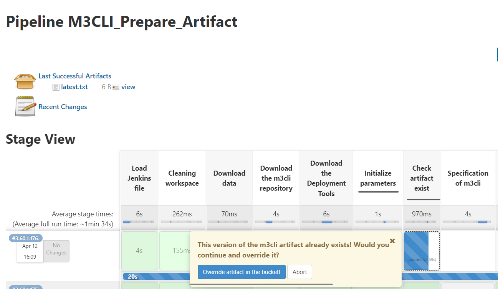

## Artifact Overwrite Confirmation

Description: Several jobs have additional pop-up confirmation of overwriting
artifacts if the same version exists in the S3 bucket.

### Steps to confirm additional action:
1. Go to the `M3CLI_Prepare_Artifact` Job or another job and confirm action:
   

