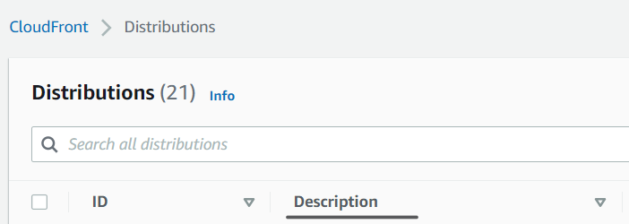
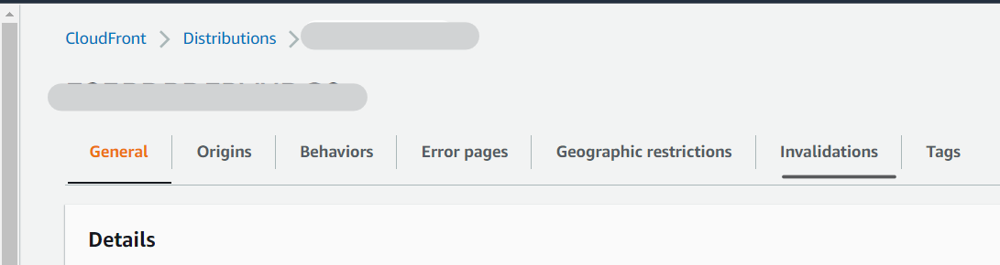
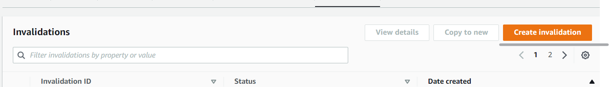
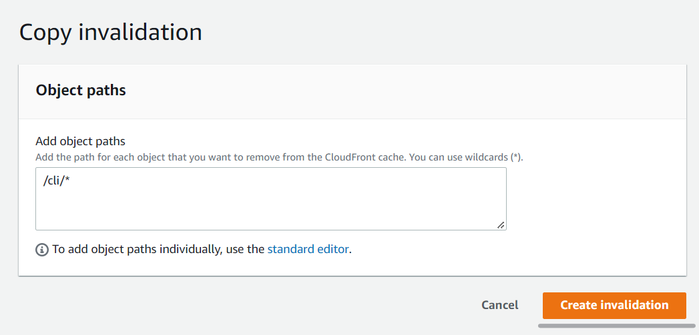
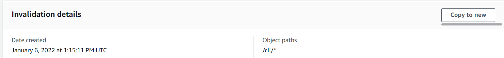

## Clearing ENV site cache in CloudFront

Description: After successfully building and deploying need to reset the cache
so that the new version of the tool appears as quickly as possible This will
clear its cache, which may allow you to access websites you couldn't previously

Do the following steps:

1. Sign in
   to [AWS Core Account](https://eu-central-1.console.aws.amazon.com/console/).
2. Go to the `CloudFront` services and click `Distribution` menu and
   choose `Descriptions` field
   

3. Select the required website address and click it. Example:
    - DEV2 - m3dev2.cloud.epam.com
    - QA - m3qa.cloud.epam.com
4. Click `Invalidation` field
   

5. Click the `Create invalidation` button with the following content:
   
   

   Or choose available validation with the `/cli/*` content and click
   the `Copy to new` button and confirm
   
