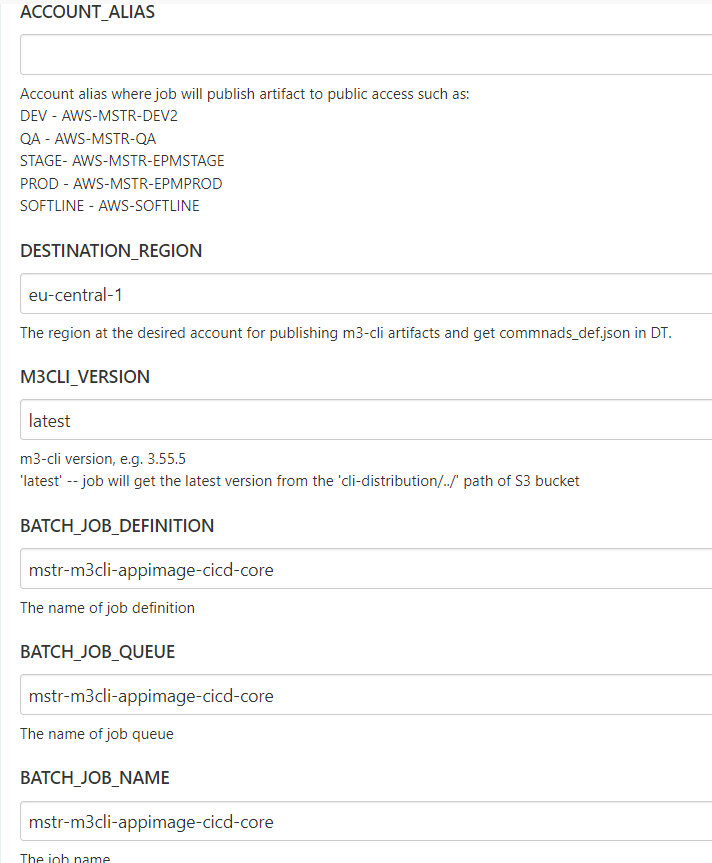

# The CICD Flow of th m3-cli tool

## Build/Deploy-Artifacts in one Job

1. Go to [CI\CD](https://m3ci.cloud.epam.com/). Select the `M3CLI` tab.
2. Select the `M3CLI_Deploy_Artifacts` job.
3. Click to `Build with Parameters`

   

4. Choose ENV to deploying artifacts in the `ACCOUNT_ALIAS` field and set
   the `DESTINATION_REGION` field.
5. Set `M3CLI_VERSION` field where available the following formats:
    - `latest` - job will get the latest version from the `cli-distribution`
      /../../' path of S3 bucket
    - `3.60.0` - job will get the current version from the `cli-distribution`
      /../../' path of S3 bucket

6. Mark the `PREPARE_ARTIFACT` checkbox and set the `M3CLI_BRANCH` field for
   preparing artifact from a custom branch.
7. Specify the `DEPLOY_TOOLS_BUNDLE` field. See to the latest success job
   in [Deploy_Tools_Build_Pack](https://m3ci.cloud.epam.com/view/0.ARTIFACTS/job/Deploy_Tools_Build_Pack/)
   pipeline with the `M3config` Stage
8. Mark the `BUILD_ARTIFACT` checkbox together with the `PREPARE_ARTIFACT`
   checkbox for preparing and building artifacts
   _Note_ that if the `ON_PREM_MODE` is marked the Job will be builded/deployed
   artifacts to the custom S3 bucket in the Core account
   `CI_CD_TEMPORARY_STORAGE` - specifies the name of the custom S3 bucket in the
   Core account

   

   

9. Click the `Build` button for the starting process of the building

**_Note that If the buildable version of the artifact has already been built
before, the job will likely be confirmed to overwrite old artifacts in the
following pipelines:_**!!!

- M3CLI_Prepare_Artifact
- M3CLI_Deploy_Artifacts

Refer
to [Artifact Overwrite Confirmation](../docs/Artifact Overwrite Confirmation.md)
for more details.

10. Reset ENV site cache in CloudFront

Refer
to [Clear Cache in CloudFront](../docs/Reset Cache in CloudFront.md)
for more details.

**Notate:** Use the `Rebuild` button it allows the user to rebuild a
parametrized build without entering the parameters again. It will also allow the
user to edit the parameters before rebuilding

_____________________________________________________________________________________________________

## Build/Deploy-Artifacts by few Jobs

### Pipeline M3CLI_Prepare_Artifact

Description: This jobs pulls the m3-cli tool from the repository and makes
changes in the tool depending on the ENV where it will be deployed.

1. Go to [CI\CD](https://m3ci.cloud.epam.com/). Select the `M3CLI` tab.
2. Select the `M3CLI_Prepare_Artifact` job.

   **_Note that If the buildable version of the artifact has already been built
   before, the job will likely be confirmed to overwrite old artifacts._**!!!

3. Click to `Build with Parameters`
4. Set the `M3CLI_BRANCH` field for preparing artifact from a custom branch.
5. Choose ENV for preparing artifacts in the `ACCOUNT_ALIAS` field and set
   the `DESTINATION_REGION` field.

   

6. Specify the `DEPLOY_TOOLS_BUNDLE` field. See to the latest success job
   in [Deploy_Tools_Build_Pack](https://m3ci.cloud.epam.com/view/0.ARTIFACTS/job/Deploy_Tools_Build_Pack/)
   pipeline with the `M3config` Stage
7. Click the `Build` button for the starting process of the building

### Pipeline M3CLI_Build_Artifacts

Description: This jobs build the m3-cli tool and upload artifacts to the main S3
bucket.

1. Go to [CI\CD](https://m3ci.cloud.epam.com/). Select the `M3CLI` tab.
2. Select the `M3CLI_Build_Artifacts` job.
3. Click to `Build with Parameters`
4. Choose ENV for preparing artifacts in the `ACCOUNT_ALIAS` field and set
   the `DESTINATION_REGION` field.
5. Set `M3CLI_VERSION` field where available the following formats:
    - `latest` - job will get the latest version from the `cli-distribution`
      /../../' path of S3 bucket
    - `3.60.0` - job will get the current version from the `cli-distribution`
      /../../' path of S3 bucket

   

6. Specify the `BATCH_JOB_DEFINITION`, `BATCH_JOB_QUEUE`, `BATCH_JOB_NAME`
   fields. These fields determine the Batch environment will be used. Use the
   default values
7. Click the `Build` button for the starting process of the building

## CICD workflow of the m3-cli tool

